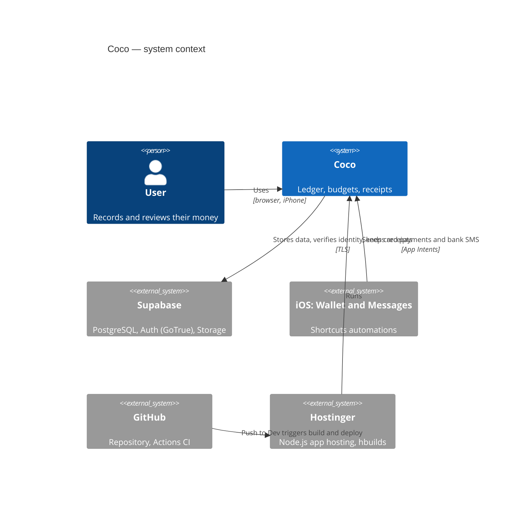
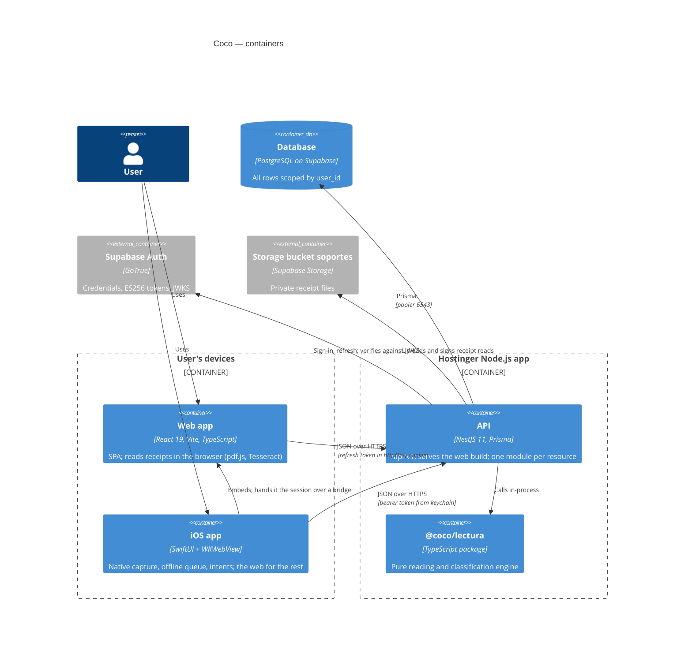
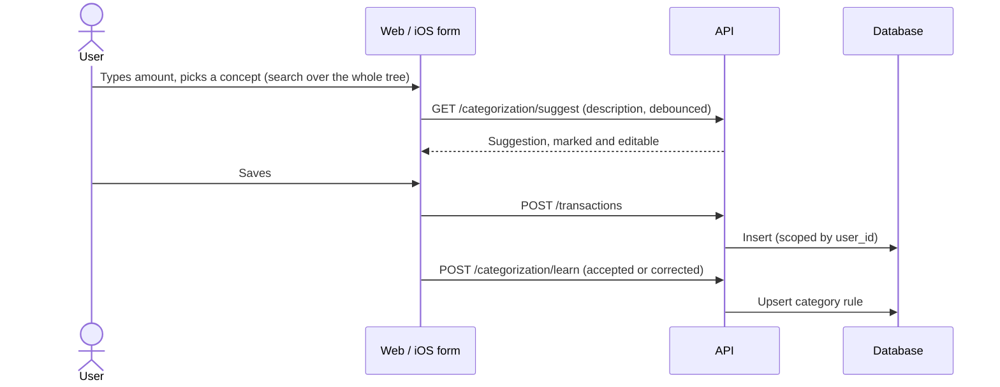
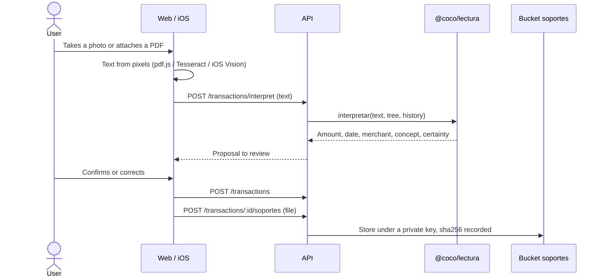

# Coco architecture

Coco is a personal-finance ledger: transactions are the core, and balances,
budgets, debts and goals are derived from them, never stored. It is a
modular monolith — one NestJS process serving the API and the web build —
with PostgreSQL, Auth and receipt storage on Supabase, and two clients: the
web app and a hybrid iOS app. How to run it is in the [README](../README.md);
how to operate it, in the [runbook](runbook.md).

## Context (C4 level 1)



## Containers (C4 level 2)



The browser never talks to Supabase: every call goes through the API, which
derives `user_id` from the verified token on every request.

## Main flows

### Manual registration (web or iOS form)



### With a photo or a file



### Wallet and SMS (iOS automations)

```mermaid
sequenceDiagram
  participant W as Wallet / Messages
  participant I as iOS intent
  participant Q as On-device queue
  participant A as API
  participant L as @coco/lectura
  participant D as Database
  W->>I: Card payment or bank SMS (Shortcuts automation)
  I->>Q: Persist with a new UUID external_ref
  Q->>A: POST /transactions/capture (text, source, external_ref)
  A->>L: interpretar()
  A->>D: Insert, or return the existing row on (user_id, external_ref)
  A->>D: Merge Wallet and SMS of the same purchase within 10 minutes
  A-->>Q: 200 with repetido / fusionado
  Note over Q,A: Retries with backoff until 200; a repeat never duplicates
```

Low-certainty or amount-less captures are saved with `por_revisar` so a person
looks at them; nothing is filed silently.

## Key decisions

| Decision                                                  | ADR                                                                                     |
| --------------------------------------------------------- | --------------------------------------------------------------------------------------- |
| Modular monolith; modules talk only through services      | [0001](adr/0001-modular-monolith.md)                                                    |
| Portable-first stack on a zero-cost host                  | [0002](adr/0002-portable-first-stack.md)                                                |
| PostgreSQL and identity on Supabase; the API is the door  | [0003](adr/0003-postgres-and-auth-on-supabase.md)                                       |
| One reading engine, run by the API                        | [0004](adr/0004-reading-engine-in-the-api.md)                                           |
| Idempotent writes by `external_ref`                       | [0005](adr/0005-idempotency-by-external-ref.md)                                         |
| Hybrid iOS app with one session                           | [0006](adr/0006-hybrid-ios-app.md)                                                      |
| Supabase data API closed by a script after each migration | [0007](adr/0007-close-supabase-data-api-by-script.md)                                   |
| Additive migrations; expand and contract                  | [0008](adr/0008-expand-and-contract-migrations.md)                                      |
| Trunk-based; `Dev` deploys, only through `merge.sh`       | [0009](adr/0009-trunk-based-with-dev-as-deploy-branch.md)                               |
| Row-level security with an application role (proposed)    | [0010](adr/0010-rls-with-application-role.md)                                           |
| Phase 7 tooling changes                                   | [0011](adr/0011-i18next-no-literal-string.md)–[0016](adr/0016-lighthouse-cli-script.md) |
